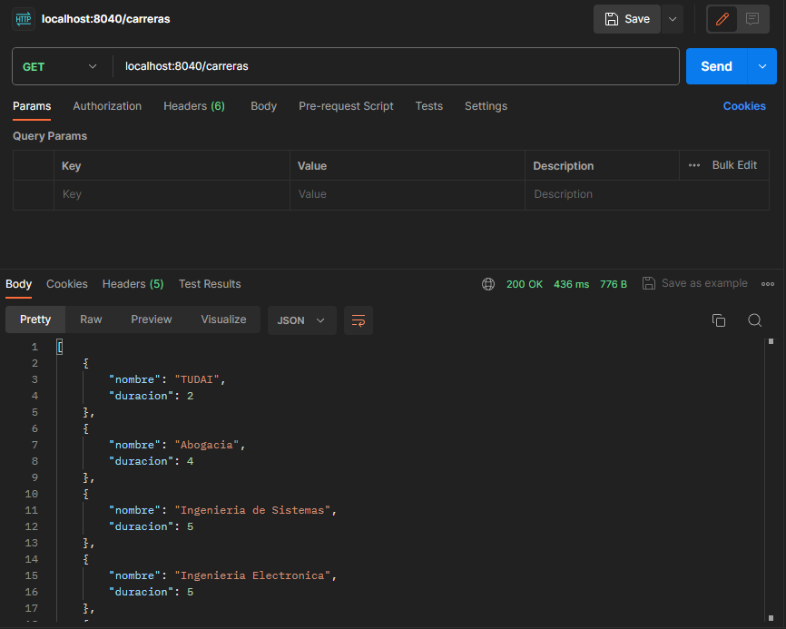
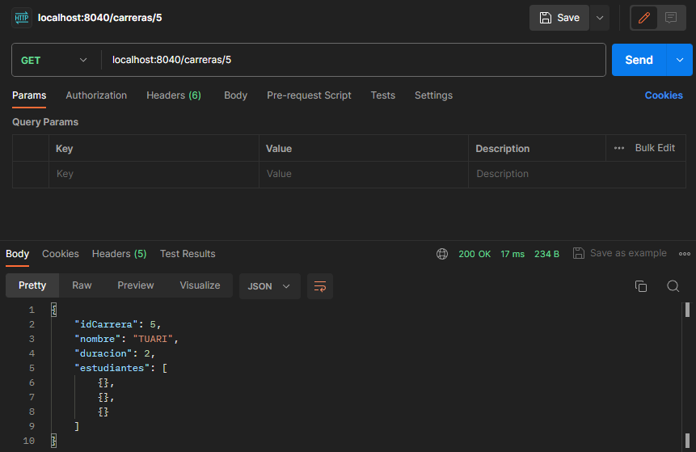

# ENDPOINTS DE CARRERA 

## Obtiene todas las carreras de la base de datos

### "/carreras"

## Obtener carrera por ID
### "/carreras/id"

## Agregar Carrera
### "/carreras/agregar/carrera"

*INSERTAR CAPTURA

## Eliminar Carrera
### "/carreras/delete/id"

*INSERTAR CAPTURA

## Obtener carreras por cantidad de inscriptos
### "/carreras/porcantInscriptos"

*INSERTAR CAPTURA

# ENDPOINTS ESTUDIANTE

## Obtener todos los estudiantes
### "/estudiantes"

## Obtener estudiante por Id que seria el dni
### "/estudiantes/id"

*INSERTAR CAPTURA

## Obtener estudiantes por Genero
### "/estudiantes/genero/genero"

*CONSULTAS*

-[ ] Cuando se obtiene carrera por id muestra en postman "estudiantes": vacio
-[ ] Probar el agregar carrera
-[ ] Probar el eliminar carrera
-[ ] El por cantidad de inscriptos los id son todos 0
-[ ] AL REPORTE CARRERA LE FALTA LA QUERY CORRECTA
-[ ] Obtener estudiante por id muestra en el postman las carreras vacias
-[ ] probar agregar estudiante
-[ ] probar eliminar estudiante
-[ ] estudiantes por nro de libreta muestra carreras vacias
-[ ] NO ANDA BUSCAR ESTUDIANTE POR CARRERA Y CIUDAD 
-[ ] FALTA MATRICULA CONTROLLER Y TODO DE MATRICULA
-[ ] guardar las capturas en una carpeta de imagenes