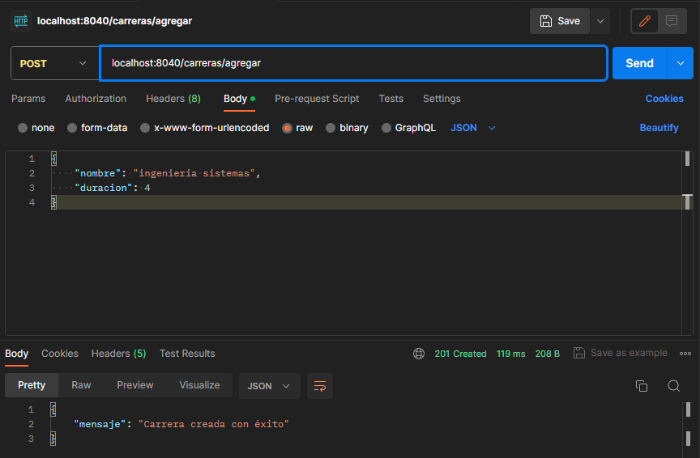
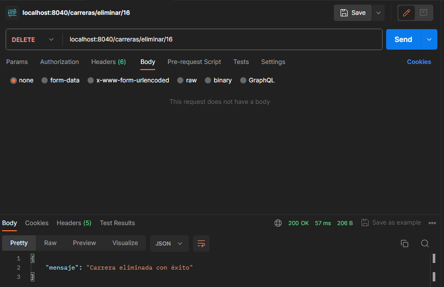
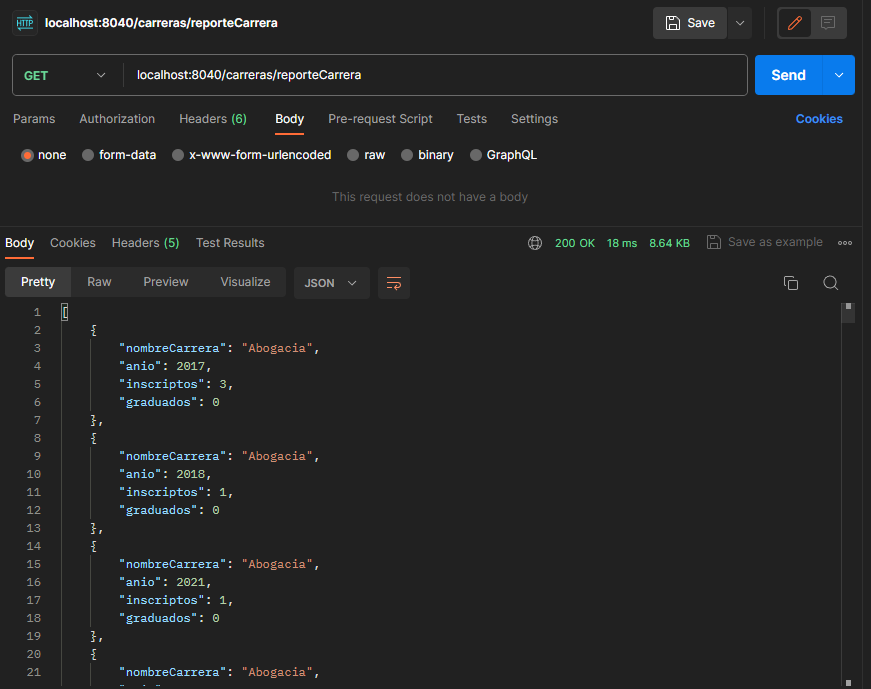
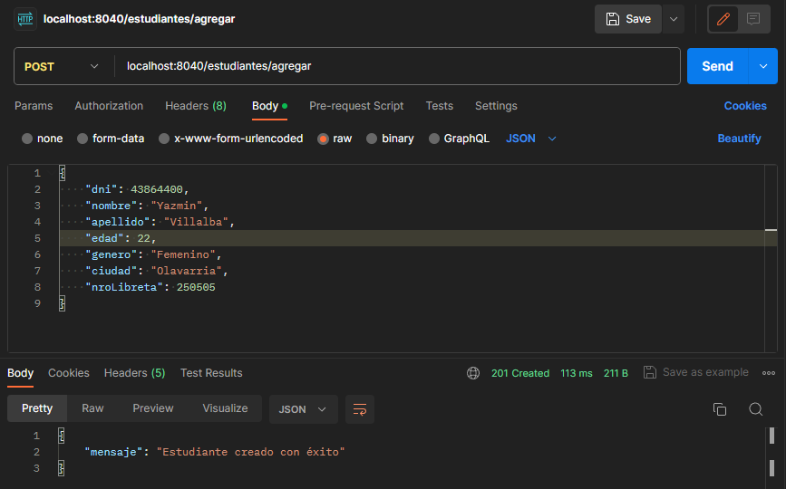
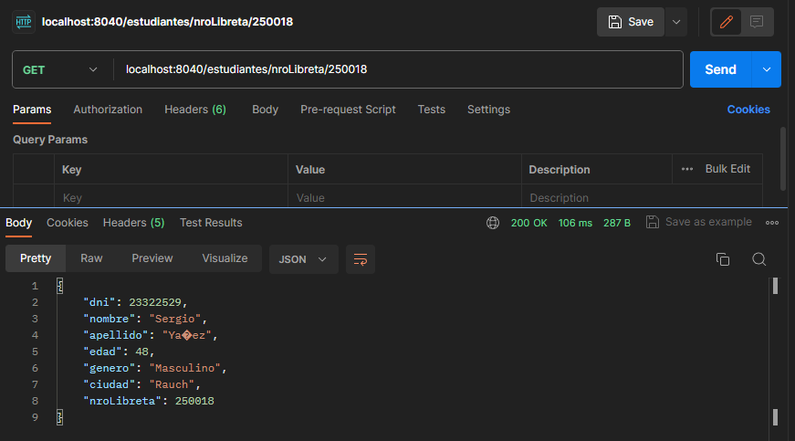
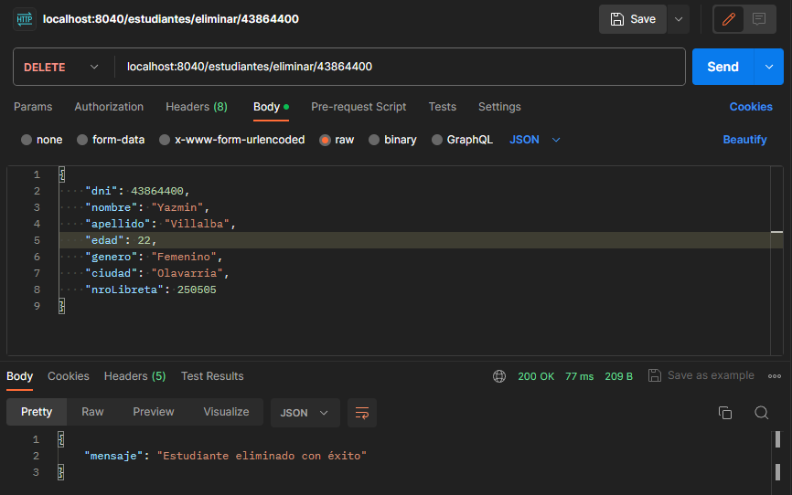

# ENDPOINTS DE CARRERA 

## Obtiene todas las carreras de la base de datos

### "/carreras"

## Obtener carrera por ID
### "/carreras/id"

## Agregar Carrera
### "/carreras/agregar/carrera"

## Eliminar Carrera
### "/carreras/delete/id"

## Obtener carreras por cantidad de inscriptos
### "/carreras/porcantInscriptos"

## Reporte de carreras
### "/carreras/reporteCarrera"

# ENDPOINTS ESTUDIANTE

## Obtener todos los estudiantes
### "/estudiantes"

## Agregar Estudiante
### "/estudiantes/agregar/Estudiante"

## Obtener estudiante por Id que seria el dni
### "/estudiantes/id"

## Obtener estudiante por nro de libreta
## "estudiantes/nroLibreta/nroLibreta"

## Obtener estudiantes por Genero
### "/estudiantes/genero/genero"

## Obtener estudiantes por carrera y ciudad 
### "/estudiantes/carreraycuidad/TUDAI/Rauch"

## Elimiar Estudiante
### "/estudiantes/eliminar/id"

# ENDPOINTS DE MATRICULA

*CONSULTAS*

-[ ] FALTA CRUD MATRICULA 
-[ ] CAMBIAR NOMBRE DE IMAGENES 
- [ ] FALTAN DIAGRAMAS