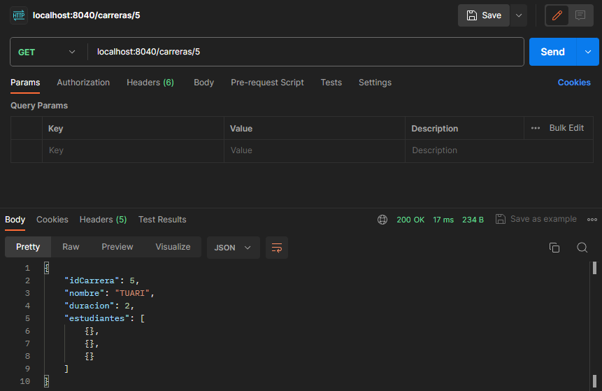
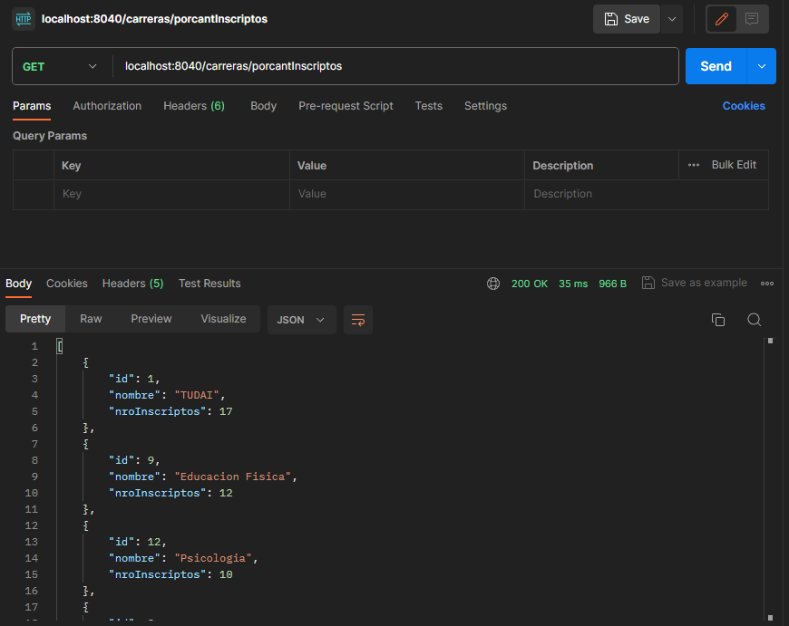
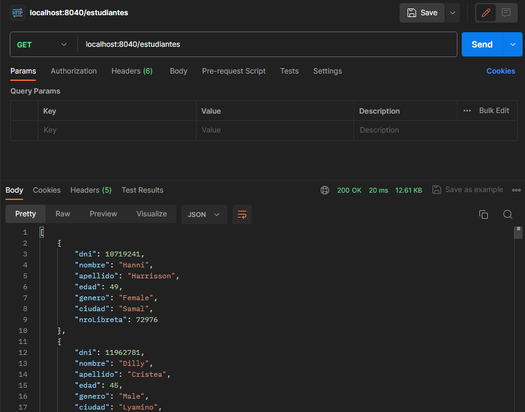
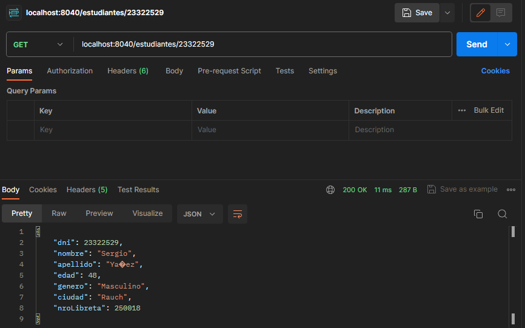
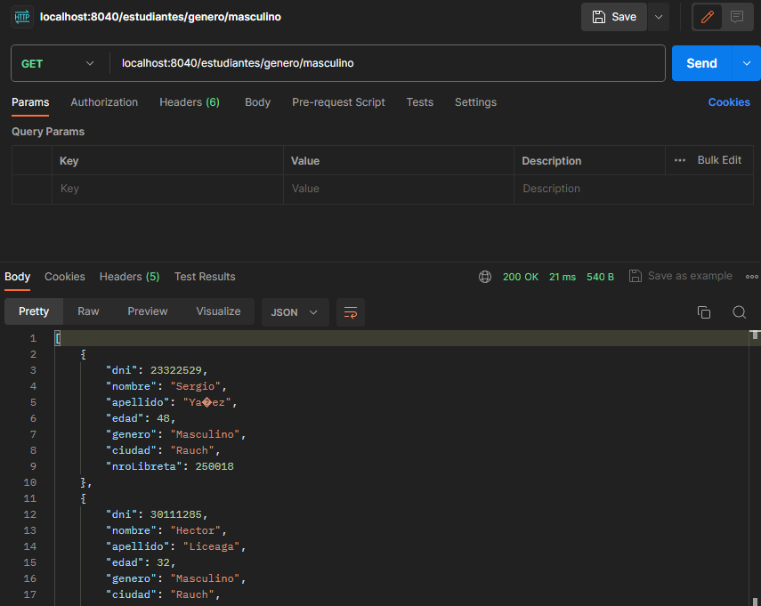
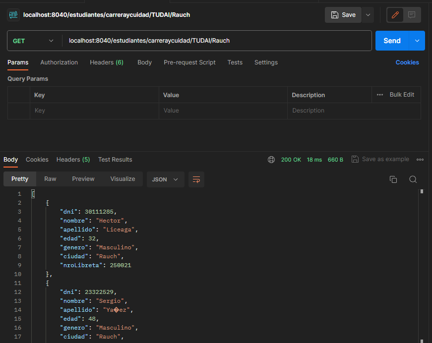

# ENDPOINTS DE CARRERA 

## Obtiene todas las carreras de la base de datos

### "/carreras"

## Obtener carrera por ID
### "/carreras/id"

## Agregar Carrera
### "/carreras/agregar/carrera"

*INSERTAR CAPTURA

## Eliminar Carrera
### "/carreras/delete/id"

*INSERTAR CAPTURA

## Obtener carreras por cantidad de inscriptos
### "/carreras/porcantInscriptos"

# ENDPOINTS ESTUDIANTE

## Obtener todos los estudiantes
### "/estudiantes"

## Obtener estudiante por Id que seria el dni
### "/estudiantes/id"

## Obtener estudiantes por Genero
### "/estudiantes/genero/genero"

## Obtener estudiantes por carrera y ciudad 
### "/estudiantes/carreraycuidad/TUDAI/Rauch"

## Agregar Estudiante
### "/estudiantes/agregar/Estudiante"

## Elimiar Estudiante
### "/estudiantes/eliminar/id"

*CONSULTAS*

-[x] Cuando se obtiene carrera por id muestra en postman "estudiantes": vacio
-[ ] Probar el agregar carrera
-[ ] Probar el eliminar carrera
-[x] El por cantidad de inscriptos los id son todos 0
-[ ] AL REPORTE CARRERA LE FALTA LA QUERY CORRECTA
-[x] Obtener estudiante por id muestra en el postman las carreras vacias
-[ ] probar agregar estudiante
-[ ] probar eliminar estudiante
-[x] estudiantes por nro de libreta muestra carreras vacias
-[x] NO ANDA BUSCAR ESTUDIANTE POR CARRERA Y CIUDAD 
-[ ] FALTA MATRICULA CONTROLLER Y TODO DE MATRICULA
-[ ] Matricula all deberia tambien devolver el estudiante y la carrera
-[ ] Solucionar paths absolutos en el csv loader